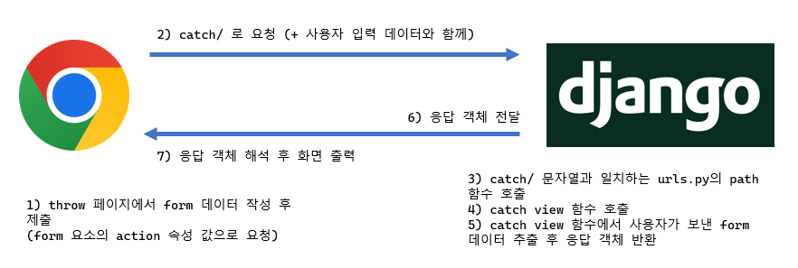

# Django Template system
파이썬 **데이터(context)를 HTML 문서(template)와 결합**하여, **로직과 표현을 분리**한 채 동적인 웹페이지를 생성하는 도구.

'페이지 틀'에 '데이터'를 동적으로 결합하여 수많은 페이지를 효율적으로 만드는게 목적

`views.py`에서
```
def index(request):
  context = {
    'name' : 'Jane',
  }
  return render(request, 'articles/index.html', context)
```
하고나서 딕셔너리의 키를 삽입
`index.html`의 <body> 부분에 `Hello, {{ name }}` 이렇게

## Django Template Language (DTL)
Template에서 조건, 반복, 변수 등의 프로그래밍적 기능을 제공하는 시스템

### 1. Variable
render 함수의 세번째 함수로 **딕셔너리 타입**으로 전달, 딕셔너리 key에 해당하는 문자열이 template에서 사용가능한 변수명
`{{ variable }}`
`{{ variable.attribute }}`


### 2. Filters
변수를 수정할 때 사용 (변수 + '|' + 필터)
`{{ variable|filter }}`
`{{ name|truncatewords:30 }}`

### 3. Tags
반복 또는 논리를 수행하여 제어 흐름 만듦
``
```
 
  <h1>이거 출력해줘<h1>

  <h1>이거 출력하지마<h1>

```

### 4. Comments
- 주석
  - inline
  `<h1>Hello, {# name #}</h1>`
  - multiline
  ```
  
  ...
  
  ```
  
---
 
## 템플릿 상속 (Template inheritance)
1. 페이지의 **공통요소**를 포함
2. 하위 템플릿이 **재정의할 수 있는 공간**을 정의 

→ 여러 템플릿이 공통요소를 공유할 수 있게 해주는 기능.
`extends` tag와 `block` tag가 있음

상위 템플릿 (base.html) 의 body 부분에
```


```

하위 템플릿 (index.html) 의 반드시 **최상단**에
```


...

```

---


## 요청과 응답
데이터를 보내고 가져오기 .. HTML `form` element를 통해서 !

### `'form'` element
사용자로부터 할당된 데이터를 서버로 전송하는 HTML 요소
`https://search.naver.com/search.naver?query=hello`에서
query가 input의 name 속성, hello는 input의 데이터

### action
### method
- 데이터를 어떤 방식으로 보낼 것인지 정의
- 데이터의 HTTP request method(GET, POST)를 지정

### `throw` 로직 - `catch` 로직

`urls.py`에서
```
path('throw/', views.throw),
path('catch/', views.catch)
```

`views.py`에서
```
def throw(request):
  return render(request, 'articles/throw.html')

def catch(request):
  context = {
    'name' : request.GET.get('name')
  }
  return render(request, 'articles/catch.html', catch)
```

하고나서 `throw.html`에서
```


<form action ="catch">
  <label for="name">이름: </label>
  # 이때 for에는 id의 값이 들어가야함
  <input type="text" name="name" id="name">
  <input type="submit">
</form>

```

urls.py랑 views.py 수정해준 뒤에 `catch.html`에서
```


<h1>Hello, {{ name }} !!!</h1>

```


### `'input'` element
type 속성 값에 따라 다양한 유형의 입력 데이터를 받음. 핵심 속성 - 'name'이자 사용자가 입력 데이터에 붙이는 이름(key)

`urls.py`에서
```
urlpatterns = [
  path('introduce/<str:username>/', views.introduce),
]
```
그리고 `views.py`에서
```
from django.shortcuts import render

def introduce(request, username):
  context = {
    'username' : username
  }
  return render(request, 'introduce.html', context)
```
그리고 `introduce.html`에서
```
<h3> {{ username }}님의 프로필 페이지입니다. </h3>
```

### Query String Parameters
'&'로 연결된 key=value쌍으로 URL 주소에 파라미터를 통해 서버로 보내는 방법
`http://host:port/path?key=value&key=value`

### URL dispatcher (운항 관리자, 분배기)
URL 패턴을 정의하고 해당 패턴이 일치하는 요청을 처리할 view 함수를 연결(매핑)
### Variable Routing
`<path_converter: variable_name>`

```
path('articles/<int:num>/' , views.detail)
path('hello/<str:name>/', views.greeting)
```

### APP URL
각 앱의 urls.py에서 각자의 URL 관리
명시적 상대 경로 `from . import views` 이렇게
```
from django.urls import path, include

urlpatterns = [
  path('admin/', admin.site.urls)
  # 클라이언트 요청 추가 /articles/까지 일치하면
  # 나머지 주소는 articles 앱의 urls.py로 넘김
  path('articles/', include('articles.urls'))
]
```

### `include ('app.urls')`
프로젝트 내부 앱들의 URL을 참조할 수 있도록 매핑

### `'url' tag`
``
주어진 URL 패턴의 이름과 일치하는 절대 경로 주소 반환

### 'app_name'
여러 개의 앱 URL 이름이 겹칠 때 성(key) 지정해주기로.

`app_name = 'articles'` 먼저 써줌
그리고 url 태그도
``처럼 변경시켜줘야함