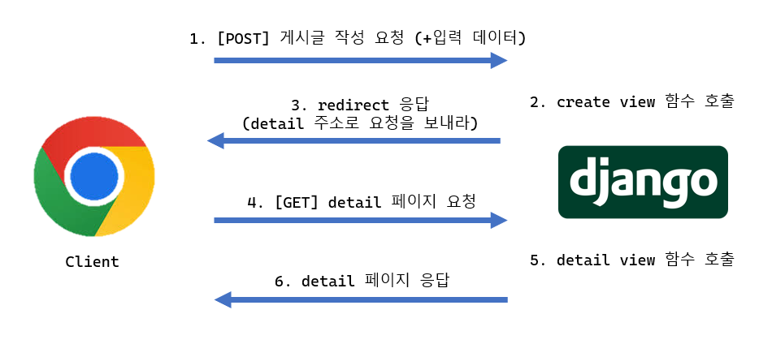

# ORM with view
웹 페이지에 보여줄 데이터를 DB에서 가져올 때, 사용자가 입력한 새로운 데이터를 DB에 저장할 때 사용.

crud/urls.py 에서
```
from django.urls import path, include

urlpatterns = [
  path('admin/', admin.site.urls),
  path('articles/', include('articles.urls')),
]
```

articles/urls.py에서
```
from django.urls import path
from . import views

urlpatterns = [
  path('', views.index, name='index'),
]
```

articles/views.py에서
```
from .models import Article

def index(request):
  articles = Article.objects.all()
  context = {
    'articles' : articles,
  }

  return render(request, 'articles/index.html', context)
```

articles/index.html에
```
<h1>Articles</h1>
<hr>

  <p>글 번호 : {{ article.pk }}</p>
  <p>글 제목 : {{ article.title }}</p>
  <p>글 내용 : {{ article.content }}</p>
  <hr>

```

### `Read`
게시글 상세 페이지를 응답하는 함수
1. 몇번 게시글인지를 DB에 조회
2. 조회한 상세 게시글 데이터를 템플릿과 함께 응답

urls.py에서 urls.patterns에서 `path('<int:pk>/', views.detail, name='detail')`

views.py에서
```
def detail(request, article_pk):
  # 1. 단일 게시글 조회
  article = Article.objects.get(pk=article_pk)

  # 2. 단일 게시글 데이터와 템플릿을 응답
  context = {
    'article' : article,
  }
  return render(request, 'articles/detail.html', context)
```

detail.html에서 각각 `{{article.pk}}`, `{{article.title}}` 등등 삽입

### `Create`
urls.py에서 urls.patterns에 `path('new/', views.new, name='new')`와 `path('create/', views.create, name='create')`

views.py에서
```
# 사용자가 게시글 생성을 위한 작성 페이지를 응답하는 함수
def new(request):
  return render(request, 'articles/new.html')

# 1. 사용자로부터 입력 받은 데이터를 추출
# 2. 추출한 데이터를 DB에 저장
# 3. 저장이 완료되었다는 페이지를 응답
def create(request):
  # 1.
  title = request.GET.get('title')
  content = request.GET.get('content')

  # 2. DB에 저장
  # 2.1
  article = Article()
  article.title = title
  article.content = content
  article.save()

  # 2.2
  article = Article(title=title, content=content)
  article.save()

  # 2.3
  Article.objects.create(title=title, content=content)
  return render(request, 'articles/create.html')
```
✏️*Create 메서드에서 `Article.objects.create()`는 객체를 만들고 즉시 DB에 저장함*

new.html에서 `article = Article()`, `article.title = title`, 등등 기입

### HTTP
네트워크 상에서 **데이터(리소스)** 주고받기 위한 약속

## GET vs POST
|비교|GET|POST|
|----|----------|----------|
|데이터 전송 방식|URL의 Query string parameter|HTTP body|
|데이터 크기 제한|브라우저 제공 URL의 최대 길이|제한 X|
|사용 목적|데이터 검색 및 조회|데이터 제출 및 변경|
✏️*GET: 응답 결과를 브라우저가 캐싱할 수 있음*
✏️*GET: URL에 데이터가 노출됨*

### HTTP response status code
서버가 클라이언트의 요청에 대한 처리 결과를 나타내는 **3자리 숫자**

ex) `403 Forbidden`: 서버에 요청이 전달되었지만, **권한** 때문에 거절되었다는 의미

### CSRF (Cross-Site-Request-Forgery, 사이트 간 요청 위조)
**사용자가 자신의 의지와는 무관하게** 공격자가 의도한 행동을 특정 웹사이트에 요청하게 만듦 -> 막기 위해 **CSRF 토큰**이라는 안전장치 사용


### Redirect

HTTP 표준 관점에서 새로고침 시 중복 게시물 작성의 위험이 있기도 하고, 사용자 경험의 관점에서도 로직 흐름이 어색함 

따라서 실제로 서버가 클라이언트를 직접 다른 페이지로 보내는 것이 아닌 **클라이언트가 GET 요청을 한번 더 보내도록 응답하는 것** !!

`redirect()` : 클라이언트가 인자에 작성된 주소로 다시 요청을 보내도록 하는 함수
```
import render, 옆에 redirect 하고
# 2.3에서
return redirect('articles:index')
# 혹은
return redirect('articles:detail', article.pk)
```

### Delete
```
# articles/urls.py
urlpatterns = [
  path('<int:pk>/delete/', views.delete, name='delete'),
]
```
```
# articles/views.py
def delete(request, pk):
  article = Article.objects.get(pk=pk)
  article.delete()
  return redirect('articles:index')
```
```
# articles/detail.html
...
<form action = "" method ="POST">

<input type="submit" value="DELETE">
</form>
<a href="">[back]</a>
```

### Update (Edit도 같이)
```
# articles/urls.py
urlpatterns = [
  path('<int:pk>/edit/', views.edit, name = 'edit'),
  path('<int:pk>/update/', views.update, name = 'update'),
]
```
```
# articles/views.py
def edit(request, pk):
  article = Article.objects.get(pk=pk)
  context = {
    'article':article,
  }
  return render(request, 'articles/edit.html', context)

def update(request, pk):
  article = Article.objects.get(pk=pk)
  article.title = request.POST.get('title')
  article.content = request.POST.get('content')
  article.save()
  return redirect('articles:detail', article.pk)
```
articles/edit.html에도 `<form action="" method="POST">``value = {[article.title]}`, `{{article.content}}`로 수정하고 articles/detail.html에도 `a href="">EDIT</a><br>` 하이퍼링크 작성