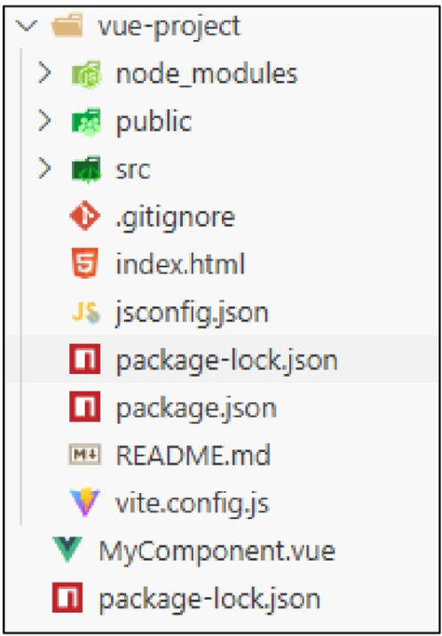

### Component
재사용 가능한 코드 블록. UI를 독립적이고 재사용 가능한 일부분으로 분할하고 각 부분을 개별적으로 다룸

### Single-File Components (SFC)
- 컴포넌트의 템플릿, 로직 및 스타일을 하나의 파일로 묶어낸 특수한 파일 형식 (*.vue 파일)
- 화면 구조를 담당하는 `<template>`, 로직을 담당하는 `<script>`, 스타일을 나타내는 `<style>` 이렇게 세 부분으로 나누어짐

---

### Vite
빠른 개발 환경을 위한 **빌드** 도구와 개바라 서버 제공. 개발 시에는 파일이 필요할 때만 요청해 속도 높이고, 배포 시에는 최적화된 파일로 묶어주는 (번들링) 역할 수행

### Build
프로젝트 소스 코드 최적화, 번들링하여 배포할 수 있는 형식으로 변환

### Node Package Manager (NPM)
Node.js의 기본 패키지 관리자

### Node JS
Chrome의 V8 JavaScript 엔진을 기반으로 하는 **Server-Side** 실행 환경
- 브라우저 안에서만 동작할 수 있던 JavaScript를 브라우저가 아니니 **서버 측에서도 실행**할 수 있게 함

### Module
프로그램을 구성하는 독립적인 코드 블록 (*.js 파일)
but 모듈 간이 의존성이 깊어지면서 성능 병목 현상 발생 → Bundler

### Bundler
여러 모듈과 파일을 하나(혹은 여러 개)의 번들로 **묶고** 최적화하여 사용할 수 있게 만들어주는 도구

---

### Vue Project 기본 구조

src 디렉토리

컴포넌트, 스타일, 라우팅 등 프로젝트의 **핵심 코드 관리**
- src/assets
- src/components
- src/App.vue
- src/main.js

---

### Virtual DOM
가상의 DOM을 메모리에 저장하고 실제 DOM과 동기화하는 프로그래밍 개념
- 효율성 + 반응성 + 추상화

- Virtual DOM 내부 렌더링 과정
1. 작성한 HTML 템플릿을 Virtual DOM을 그려내는 설계도 (렌더 함수 코드)로 변환
2. 렌더 함수 코드를 바탕으로 Virtual DOM 생성
3. Virtual DOM을 실제 DOM에 마운트
4. 컴포넌트의 데이터(반응형 상태)가 바뀔 때마다 새로운 가상돔을 만들어 이전과 비교하고, 바뀐 부분만 효율적으로 찾아 실제 DOM을 업데이트

- 실제 DOM에 직접 접근하지 말고 Vue의 ref()와 Lifecycle Hooks 함수 사용해 **간접적으로 접근하여 조작**할 것 !
